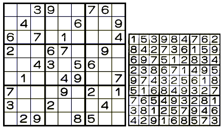

# vg101: Introduction to Computer Programming 

## RC 2

*CHEN Xiwen*

*2019/5/26*

### Outline

* Function handles
* Pseudorandom numbers
* File IO
* Recursion and iteration
* Practices

### Function Handles

1. Basics: 

   * Definition: `f = @(x) expressions`

   * Multiple inputs: `f = @(x, y) x^2 + y^2`

   * Multiple outputs: not explicitly supported, but can be realized by

     ```matlab
     f = @(x, y) [x^2 + y^2, x - y];
     res = f(2, 3);
     a = res(1);
     b = res(2);
     ```

   * Function call: `f(args)`

2. Usage: `<demoFuncHandle.m, myLess.m, mySort.m, mainFuncTools.m>`

   > 1. pass a function to another function.
   > 2. specify call back functions.
   > 3. construct handles to functions defined inline instead of stored in a program file.
   > 4. call local functions from outside the main function.

3. *Digression*: `syms`, create symbolic variables and functions `<demoSyms.m>`
   1. `syms var1 ... varN`  create symbolic variables `var1`, ..., `varN`, separate variables by spaces.
   2. `syms f(var1, ..., varN)`  creates the symbolic function `f` and symbolic variables `var1`, ..., `varN` representing the input arguments of `f`.

### Pseudorandom Numbers

* `rand(n, m)`: $n\times m$ matrix of random numbers in normal distribution
* `randi([min, max], n, m)`: $n\times m$ matrix of random integers in `[min, max]`
* `randn(n, m)`: $n\times m$ matrix of random numbers in standard normal distribution
* `random('name', parameters)`: generate random numbers following the distribution `name`, parameters may vary depending on the distribution
  * Names
    1. **Normal**
    2. **Uniform**
    3. Binomial
    4. Poisson
    5. ...
  * Parameters: dependent on the distribution types (documentation)
* `rng`: `<demoRng.m>`
  * `rng(seed)`: seeds the random number generator
  * `s = rng; rng(s);` stores the current random state in `s`, and restores the random state from `s`. Useful for reproduction 

* `randperm(n)`: random permutation

### File IO

* Open and close a file:

  1. `fid = fopen(filename, permission)`

     `permission`: 

     * `r`: read only
     * `w`: write to a new file
     * `a`: append to new/existing file
     * `r+`: read and write
     * `w+`: read and overwrite
     * `a+`: read and append

  2. `fclose(fid)`: **DO remember to close the file!**

* Writing to a file: `fprintf(fid, format, variables)`
* Read from a file: `<demoFileIO.m>`
  1. `fscanf(fid, format, size)`: read with format and size
  2. `fgetl(fid)`: read a line
  3. Useful functions: 
     * `frewind(fid)`: point to the start of the file
     * `split(line)`: split a line using spaces

### Recursion and Iteration

* Call stack

  ```matlab
  function mainResult = mainFunc(mainArgs)
  
  	subResult1 = subFunc1(subArgs1);
  	mainResult = subResult1;
  	
  end
  
  function subResult1 = subFunc1(subArgs1)
  	
  	subResult2 = subFunc2(subArgs2);
  	subResult1 = subResult2;
  
  end
  
  function subResult2 = subFunc2(subArgs2)
  
  	subResult2 = subArgs2;
  	
  end
  	
  ```

  

* Recursion

  1. What is this function for?
     * Accept inputs
     * Return expected outputs
     * Regardless of how it computes the outputs

  2. Given such existing function (with a somehow "reduced" problem), how can you compute the results for the original problem?
  3. Basic components of a recursive function:
     1. Base case
     2. Recipe to compute the result for the current problem from a solution of a slightly smaller problem

  4. Analogy: mathematical induction

  5. Example: factorial (suppose $n$ is a positive integer)

     ```matlab
     function fact = myFactorial(n)
     
     	if n == 1
     		fact = 1;
     	else
     		fact = n * myFactorial(n - 1);
     	end
     
     end
     ```

     **Q: What is the call stack for factorial of 5 using recursion?**

* Iteration

  1. Solve problem using loops

  2. Any self-recursive algorithm can be transformed into its iterative version.

     **Q: What is the iterative version of factorial?**

     ```matlab
     function fact = myFactorial(n)
     	
     	fact = 1;
     	for i = 1:n
     		fact = fact * i;
     	end
     
     end
     ```

  3. Why is iterative algorithms should be preferred in MATLAB, C and C++? (Memory)

     e.g., `myFibonacci(n)`

     ```matlab
     function fib = myFibonacci(n)
     
     	if n == 1 || n == 2
     		fib = 1;
     	else
     		fib = myFibonacci(n - 1) + ...
     			myFibonacci(n - 2);
     	end
     	
     end	
     ```

     Some values are calculated and stored more than once.

     **Q: What is the iterative version of the Fibonacci function?**

### Practices

1. ***Merge Sort***.

   Merge sort is a sorting algorithm that utilizes the divide and conquer strategy. Given an array $A$ of numbers, it sorts the elements in ascending order. In each function call, it divides the array into two sub-arrays with (roughly) equal sizes. Then it calls itself on these two sub-arrays. The returned sub-arrays are then in their correct orders, respectively. Then in the original function call, the two ordered sub-arrays are merged into a single array, ensuring the ascending order by putting the smaller element at the starts of two sub-arrays in the merged array. Write a function that implements this algorithm.

2. ***The Hanoi tower.***

   There are three rods, $A$, $B$, and $C$,  together with $n$ disks on rod $A$. Rods $B$ and $C$ are originally empty. With the help of rod $B$, one can move all the disks on rod $A$ onto rod $C$, without placing any larger disk on another smaller disk.

   

   The algorithm is described as follows. 

   1. Base case: if there is only one disk on rod $A$, remove that disk directly onto rod $C$.
   2. If there are $n > 1$ disk on rod $A$, then move $n - 1$ disks from rod $A$ to rod $B$ with the help of rod $C$, place the largest disk on the bottom of rod $A$ to rod $C$, then move the $n - 1$ disks from rod $B$ to rod $C$ with the help of rod $A$.

   Write a function `myHanoi(n)` that takes the number of disks $n$ as input, and output the sequence of actions to a file `hanoiOut.txt` in the following format:

   > Step $n$: move disk $m$ from rod $X$ to rod $Y$.

   $n$ is the current step number, $m$ is the disk number starting from the smallest disk, $X$ and $Y$ are certain rods. One sentence per line. For instance, `myHanoi(3)` should output:

   > `hanoiOut.txt`
   >
   > ```
   > Step 1: move disk 1 from rod A to rod C.
   > Step 2: move disk 2 from rod A to rod B.
   > Step 3: move disk 1 from rod C to rod B.
   > Step 4: move disk 3 from rod A to rod C.
   > Step 5: move disk 1 from rod B to rod A.
   > Step 6: move disk 2 from rod B to rod C.
   > Step 7: move disk 1 from rod A to rod C. 
   > ```

3. ***Solving Sudoku.***

   In the most Sudoku setting, a $9\times 9$ board is divided in to nine $3\times 3$ blocks. The player is required to fill the board with numbers $1\sim 9$, with the each number appearing exactly once in each row, column, and $3\times 3$ block. A recursive approach (although not as efficient as the *Dancing Links Algorithm*, for your interest...) is described as follows. Suppose we start from an empty board, with some positions filled as the clues. The function takes a position as an input, and outputs whether the problem can be solved using current placement.

   1. Base case: if all the cells are filled, then the Sudoku is solved.
   2. For the next empty position to be filled, for each possible number $1\sim 9$, if that number is valid to put in the cell, then place the number in this position and call the solving function with this current position. If the function returns `true` with this call, then return `true`.
   3. After trying all the values, return `false` at the end.

   Write a function that reads from a file named `sudokuIn.txt` containing a $9\times 9$ matrix, with $0$ indicating empty position, and numbers $1\sim 9$ indicating a number in that position. Then it displays a completely filled Sudoku board as the solution. A sample input with its solution is shown below.

   >`sudokuIn.txt`
   >
   >```
   >0 0 3 9 0 0 7 6 0
   >0 4 0 0 0 6 0 0 9
   >6 0 7 0 1 0 0 0 4
   >2 0 0 6 7 0 0 9 0
   >0 0 4 3 0 5 6 0 0
   >0 1 0 0 4 9 0 0 7
   >7 0 0 0 9 0 2 0 1
   >3 0 0 2 0 0 0 4 0
   >0 2 9 0 0 8 5 0 0
   >```

   