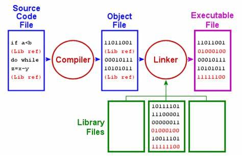

# vg101: Introduction to Computer Programming

## RC 4

CHEN Xiwen

2019/6/13

### Welcome to C!

* Compiled language: how is it transformed into machine code?

  

  Compiling source files in terminal using `gcc`:

  ```bash
  gcc filename.c -o executable
  gcc -O2 -Wall -Wextra -Werror -Wno-unused-result -std=c11 -o ./out/helloWord ./in/helloWorld.c -lm
  ```

* Differences with MATLAB:

  1. Lower-level high-level language.
  2. Declaration.
     * MATLAB: flexible data type
     * C: require explicit declaration

  3. File extension.
     * MATLAB: `.m`
     * C: `.c`, `.h`

  4. Call functions.
     * MATLAB: search in paths when functions are called
     * C: include header files

  5. Comments.
     * MATLAB: `%`
     * C: `//`, `/* */`

  6. Function definitions.

  7. Main process.

     * MATLAB: `.m` scripts

     * C: `main` function

       ```c
       #include <stdio.h>
       int main() {
       	printf("Hello, world!\n");
       	return 0;
       }
       ```

  8. Syntax.

     `{}` as a block of code, mandatory `;` at the end of each line...

* References and study resources:
  1. [C/C++ Reference](https://en.cppreference.com/w/) (highly recommended for both C and C++)
  2. [Stack Exchange](https://stackexchange.com/) (QA forum)
  3. [Geeks for Geeks](https://www.geeksforgeeks.org/) (Study website)
  4. [Tutorials Point](http://www.tutorialspoint.com/)
  5. [Stack Overflow](https://stackoverflow.com/)
  6. C Primer Plus
  7. For your explorations!

### Program Structure

#### Header Files

* Libraries: common functions written by professional programmers. (include by `#include <xxx.h>`)
  1. `stdio.h`: standard input and output.
  2. `math.h`: basic mathematical operations, `sqrt`, `sin`, `pow`
  3. `stdlib.h`: random number generation and dynamic memory
  4. `string.h`: efficient string manipulation
  5. `time.h`: timing functions

* Header files (`.h` files): custom function declarations (include by `#include "xxx.h"`)

* Header guards: prevent multiple definitions

  ```c
  #ifndef TEST_H
  #define TEST_H
  // header file contents
  #endif
  ```

#### Main Function

> 1. Never write a whole program in the main function.
> 2. Use the main function to dispatch the work to other functions.
> 3. Most of the coding must be done outside of the main function.
> 4. It only returns `0` with type `int`.
> 5. A program contains a single `main` function.

Unlike in MATLAB, `main` function is the minimum code you need to have to run a test in C. But write more functions rather than including anything in the `main` function. As a (little bit extreme) example,

```c
#include <stdio.h>

void greet() {
    printf("Hello, world\n");
}

int main() {
    greet();
    return 0;
}
```

#### Blocks

Everything in a block is regarded as *local*.

```c
#include <stdlib.h>
#include <stdio.h>

int main() {
	{
		int a = 0;
		printf("%d\n", a);
	}
	{
		double a = 1.124;
		printf("%f\n", a);
	}
	{
		char a = 'a';
		printf("%c\n", a);
	}
    return 0;
}
```

#### Variables

* Declaration: `type name (= value);`

  ```c
  int a;
  float b, c;
  unsigned int d;
  char e;
  ```

* Initialisation:

  ```c
  int a = 0;
  float b = 1.124;
  unsigned int d = 3;
  char e = 'e';
  ```

### Data Types

#### Common Data Types

* Common data types in C:
  1. `char`: ASCII code
  2. `int`: commonly 4 bytes
  3. `unsigned int`
  4. `long`
  5. `float`, `single`, `double`
  6. Logical: no bool type, `0` interpreted as `False`, otherwise `True`
  7. `void`: valueless

* Type Conversion

  1. Automatic conversion [`demoTypeConv.c`]

     ```c
     int a = 1 + 1.5;
     double b = 3 / 2;
     double c = 3 / 2.0;
     char d = 'd';
     d = d + 1;
     ```

     ***Q: What are the values of variables above?***

  2. Explicit type conversion (might lose some information)

     ```c
     double a = 1.124;
     int b = (int)a;
     ```

* Constant variables: preventing modifications, initialisation required. [`demoConst.c`]

  ```c
  const int a = 1;
  a = 2; // error;
  const int b; // will set b to default value 0;
  b = 1; // error;
  ```

* Structures

  1. Defining a structure:

     ```c
     typedef struct structName {
     	char* name;
     	int age;
     } typeName;
     ```

  2. Declaring a structure:

     ```c
     struct structName a;
     typeName b;
     ```

  3. Initialising  a structure: [`demoStruct.c`]

     ```c
     a = {"albert", 32};
     b.name = "gilbert";
     b.age = 23;
     ```

#### Operators

* Arithmetic operators: `+`, `-`, `*`, `/`, `%`

* Increment and decrement `i++` vs. `++i`

  ***Q: What are the outputs of the following code?*** [`demoIncre.c`]

  ```c
  int i = 0;
  while (i < 10) {
  	printf("%d\n", i++);
  }
  ```

  ```c
  int i = 0;
  while (i < 10) {
  	printf("%d\n", ++i);
  }
  ```

* Shorthand assignments
  1. `a += b`, `a -= b`, `a *= b`, `a /= b`, etc.
  2. `a = (x > y) ? x : y;` (convenient for conditional assignments)

* Logical operators

  | Operator |  Name   |
  | :------: | :-----: |
  |   `&&`   |   AND   |
  |   `||`   |   OR    |
  |   `!`    |   NOT   |
  |   `==`   |  EQUAL  |
  |   `!=`   | UNEQUAL |

* Bitwise operators

  | Operator |          Name           |
  | :------: | :---------------------: |
  |   `&`    |       bitwise AND       |
  |   `|`    |       bitwise OR        |
  |   `^`    |  bitwise exclusive OR   |
  |   `~`    | binary one's complement |
  |   `<<`   |       shift left        |
  |   `>>`   |       shift right       |

  Binary operations

  | `x`  | `y`  | `x & y` | `x | y` | `x^y` |
  | :--: | :--: | :-----: | :-----: | :---: |
  |  0   |  0   |    0    |    0    |   0   |
  |  0   |  1   |    0    |    1    |   1   |
  |  1   |  0   |    0    |    1    |   1   |
  |  1   |  1   |    1    |    1    |   0   |

  ```c
  // x = 0...0101011 in binary;
  int x = 43;
  printf("%d %d %d\n", ~x, x << 2, x >> 2);
  ```

  One's complement of $x$: 1...1010100, understood as a signed integer in two's complement. To get the signed results, we have to

  1. Decide sign: `-`
  2. Invert: `0...0101011`
  3. Add one: `0...0101100` ( = 44)
  4. Final result = sign + added: `-44`

  ***Q: What if x is an unsigned int?*** [`demoBinary.c`]

  ```c
  unsigned int x = 43;
  x = ~x;
  ```
  
  Here are some points to clarify:
  
  1. `int` type is signed and is usually 4-byte long, $-2^{31}\sim 2^{31}-1$.
  2. `unsigned int` is not signed and is usually 4-byte long, $0\sim 2^{32}-1$.
  3. In 2's complement, the most significant digit is used to represent sign if the type is signed, e.g., `int`. For instance, 5 is represented as `0...00101`(32 bits) and -5 is represented as `1...11011`. To get the number -5, we do the following:
     1. Decide sign: `-` (most significant bit is 1)
     2. One's complement: `0...00100`
     3. Add 1: `0...00101 = 5`
     4. Combine sign and magnitude: `-5`
  
  4. For unsigned integers, if we subtract a number by a larger number, or the result of addition exceeds `UINT_MAX`, overflow occurs and the result "wraps around". For instance, `(unsigned) 0 - (unsigned) 1 = -1 mod UINT_MAX + 1 = UINT_MAX`.
  5. Depending on Implementation, the shifting operations `<<` and `>>` append 1s or 0s to the shifted bits. For signed negative integers, `>>` can append 1s to the most significant digit so that the resulting number is still negative. For instance, `1...11011 >> 2 = 1...11110`.
  6. In formatted input, the value shown on the screen might be different from what the value really is. As is in the demo example, unsigned integers can still be printed as negative signed integers while they are actually positive (and large). So be careful with the size of your value.

### Standard Input & Output

* `printf`: similar to `fprintf` in MATLAB, `printf(formatSpec, vars);` [`demoPrint.c`]

  | Specifier |                Explanation                |
  | :-------: | :---------------------------------------: |
  |   `%c`    |             single character              |
  | `%d`/`%i` |              signed integer               |
  |   `%o`    |         unsigned integer in octal         |
  |   `%x`    |      unsigned integer in hexidecimal      |
  |   `%u`    |        unsigned integer in decimal        |
  |   `%f`    |           floating-point number           |
  |   `%e`    | floating-point number in decimal exponent |

  ```c
  printf("%d %f\n", 7 / 3, 7 / 3);
  printf("%d %f\n", 7 / 3, 7.0 / 3);
  ```

  **Note**: Explicit type conversion required to prevent warnings (which are regarded as errors in JOJ): 

  ```c
  printf("%d %f\n", 7 / 3, (double)(7 / 3));
  ```

* `scanf`: similar to `fscanf` in MATLAB, scans input from the standard input stream, `scanf(formatSpec, &vars);` [`demoStdin.c`]

  ```c
  int a, b, c;
  scanf("%d %d %d", &a, &b, &c);
  printf("a = %d, b = %d, c = %d\n", a, b, c);
  ```

### Control Statements

* IF-ELSE [`demoIfElse.c`]

  ```c
  if (condition_1) {
  	statements;
  }
  else if (condition_2) {
  	statements;
  }
  else {
  	statements;
  }
  ```

  **Note**:

  1. The statements are executed if the condition evaluates to a number other than 0.

     ***Q: What behaviors do you expect from the following code?***

     ```c
     #include <stdio.h>
     
     int main() {
     	int a;
         scanf("%d", &a);
         if (0 <= a <= 2) {
             printf("a = %d\n", a);
         }
         return 0;
     }
     ```

  2. Blocks.

     ***Q: What is the expected output of the following code?***

     ```c
     #include <stdio.h>
     
     int main() {
     	if(0) 
             printf("1\n");
         	printf("2\n");
         return 0;
     }
     ```

  3. `else if` and `else` must be paired with `if`.

* SWITCH-CASE

  ```c
  switch (variable) {
      case val_1:
          statements;
          break;
      case val_2:
          statements;
          break;
      default:
          statements;
          break;
  }
  ```

  **Note**: `break` is necessary

* WHILE [`demoWhile.c`]

  1. `while`

     ```c
     while (conditions) {
     	statements;
     }
     ```

  2. `do`

     ```c
     do {
         statements;
     } while (conditions)
     ```

* FOR

  ```c
  for (init; test; step) {
      statements;
  }
  ```

  ***Q: What is the scope of variable in the following case?***

  ```c
  for (int i = 0; i < 10; i++) {
      printf("%d\n", i);
  }
  // printf("%d\n", i);
  ```

### Practice

#### Quick Exercises

1. Write a C program that reads 5 numbers from `stdin` (space separated), and counts the numbers of positive numbers and negative numbers.

   > Input:
   > 5 -4 10 15 -1
   >
   > -------------------------------------------------------------------------------------------------------
   >
   > Output:
   > Number of positive numbers: 3
   > Number of negative numbers: 2

2. You have found Armstrong numbers in MATLAB. Now try this in C. Let the user input a number $n$, then the program should return the next Armstrong number or $n$ is $n$ is an Armstrong number. (Reminder: $153 = 1^3 + 5^3 + 3^3$)

#### FYI

1. Getting annoyed by uncertainty analysis in VP141? Write a C program to help you generate the Latex code given necessary data. (The sample code will include only the uncertainty analysis for direct measurements. Please feel free to explore programs to generate uncertainty analysis for indirect measurements. For partial derivative, you might consider evoking MATLAB from C using "engine.h". Try to search this in MATLAB documentation if you are interested, although my computer was broken when I was testing this feature, and that is why this part of the code will not be included. [smile]) **PLEASE DO modify the sample code!!!!!!**
2. ASCII art: Given a set of poker cards without the jokers, draw the first card from the deck and display it using ASCII art on the command window. Shuffle the remaining cards after each drawing. If all the cards have been drawn, prompt the user and begin with a new deck. Repeat this until user enters `q`.